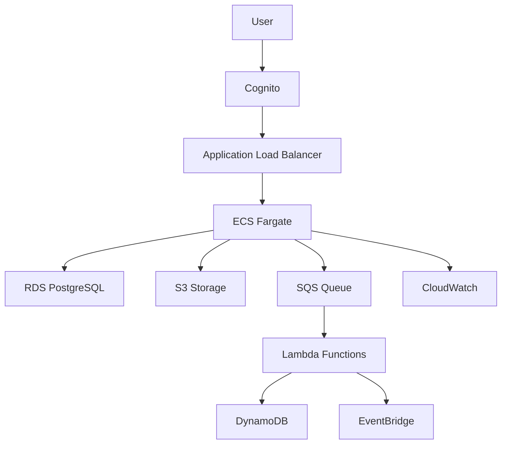

# インフラストラクチャ設計

Vitascopeのインフラストラクチャは、AWSのマネージドサービスを活用した、高可用性・スケーラブル・セキュアな構成を採用しています。

## AWSサービス統合戦略

AWSサービスを効果的に活用しながらも、開発の複雑性を管理し、ローカル開発を容易にするための戦略を採用します。

### インフラアズコード（IaC）

- **ツール**: Terraform
- **目的**: インフラ構成の可視化、コード化、バージョン管理
- **利点**: 
  - インフラ変更の追跡とレビュー
  - 環境間（開発、ステージング、本番）の一貫性
  - セルフドキュメント化されたインフラ
  - マルチクラウド対応の柔軟性
  - 宣言型アプローチによる可読性
- **モジュール化**: 
  - 共通インフラコンポーネントの再利用
  - 環境ごとの設定差分を変数で管理
  - リソースをサービス単位でモジュール化

```hcl
# Terraformモジュール構造例
terraform/
├── environments/
│   ├── dev/
│   ├── staging/
│   └── prod/
├── modules/
│   ├── database/
│   ├── cognito/
│   ├── api_gateway/
│   ├── queues/
│   └── lambda/
└── shared/
    └── variables.tf
```

### ローカル開発環境

- **LocalStack**: AWS サービスのローカルエミュレーション
  - SQS、Lambda、S3、Cognitoなどをローカルで再現
- **Docker Compose**: 開発環境の標準化
  - データベース、LocalStack、バックエンドサービスを一括起動
- **環境変数**: `LOCAL`, `DEV`, `STAGING`, `PROD`による環境切り替え

```bash
# ローカル開発環境の起動
make dev-up

# AWSエミュレーション環境の初期化
make aws-local-init

# ローカルテスト実行
make test
```

### サービス抽象化レイヤー

バックエンドコードとAWSサービスの間に抽象化レイヤーを導入し、実装の詳細を隠蔽します：

- **キュー抽象化**: `app/services/queue_service.py`
- **ストレージ抽象化**: `app/services/storage_service.py`
- **認証抽象化**: `app/services/auth_service.py`

これにより、ローカル開発時はモックまたはLocalStackを使用し、本番環境では実際のAWSサービスを使用できます。

## AWS構成図



## コンテナ戦略

- **ローカル開発**: Docker Compose
- **ステージング/本番環境**: AWS ECS (Fargate)
- **利点**:
  - サーバー管理不要のサーバーレスコンテナ実行環境
  - インフラストラクチャの管理負荷軽減
  - AWSサービスとの深い統合（IAM、CloudWatch、ALB等）
  - オートスケーリングの簡易設定
  - 費用対効果の高い運用モデル

コンテナイメージはECRに保存し、CI/CDパイプラインで自動的にビルド・デプロイします：

```
アプリケーションコード変更 → GitHub Actions → Docker イメージビルド → ECRプッシュ → ECS デプロイ
```

各環境（開発・ステージング・本番）に対応するECSサービスとタスク定義をTerraformで管理します。

## 主要AWSサービスの用途

| サービス | 用途 |
|---------|------|
| **ECS (Fargate)** | バックエンドAPIサービスのコンテナ実行環境 |
| **RDS (PostgreSQL)** | メインデータベース、構造化データの保存 |
| **Amazon Cognito** | ユーザー認証と認可 |
| **S3** | 静的アセット、バックアップ、大容量ファイルの保存 |
| **CloudFront** | コンテンツ配信、静的ファイルのキャッシュ |
| **SQS** | 非同期処理のためのメッセージキュー |
| **Lambda** | サーバーレス関数、イベント処理、バックグラウンド処理 |
| **EventBridge** | サービス間イベント連携、スケジュールタスク |
| **CloudWatch** | ログ集約、メトリクス監視、アラート |
| **WAF** | Webアプリケーションファイアウォール、セキュリティ保護 |

## セキュリティ設計

- **ネットワーク分離**: VPC、サブネット、セキュリティグループの適切な設計
- **最小権限**: IAMロールとポリシーで必要最小限の権限を付与
- **暗号化**: 保存データと転送中データの暗号化（KMS、TLS）
- **監査**: CloudTrailによるAPI呼び出しの監査
- **セキュリティグループ**: インバウンド/アウトバウンドトラフィックの制限
- **WAF**: 不正アクセスの検知と防止

## スケーリング戦略

- **オートスケーリング**: ECSサービスの自動スケーリング
- **DBスケーリング**: RDS読み取りレプリカによる水平スケーリング
- **キャッシュ**: ElastiCacheによるデータキャッシュ
- **CDN**: CloudFrontによる静的コンテンツ配信
- **負荷分散**: ALBによるトラフィック分散

## 障害復旧（DR）戦略

- **バックアップ**: RDSの自動バックアップ（日次）
- **マルチAZ**: 複数のアベイラビリティゾーンへのデプロイ
- **リードレプリカ**: 読み取り専用DBレプリカの維持
- **スナップショット**: 定期的なDBスナップショット
- **リージョン間レプリケーション**: 重要データのクロスリージョンレプリケーション 